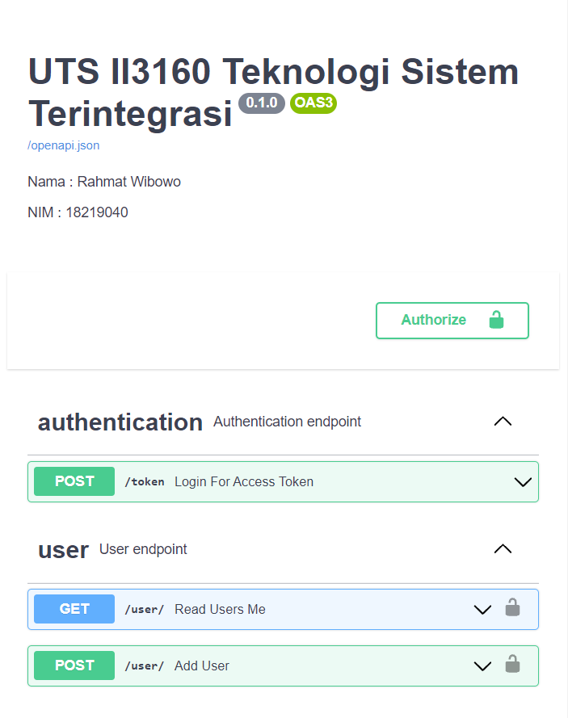

<h1 align="center">
  <br>
  API Endpoints
  <br>
  <br>
</h1>

### Nama : Rahmat Wibowo
### NIM : 18219040
<br>
<br>

## Requirements
<br>

- pipenv
- pip
- python3
## How to Use

1. Jalankan env.sh untuk mengaktivasi env
```cmd
bash env.sh
```
2. Jalankan run.sh
```cmd
bash run.sh
```
3. Bukalah url berikut pada browser
```cmd
http://localhost:8000
```

Deployment:
- Azure App Service
```
https://ii3160-18219040-uts.azurewebsites.net/
```
- Virtual Machine
```
http://128.199.151.55:8000/
```
## Tampilan



## Author

```
Rahmat Wibowo
18219040
```

